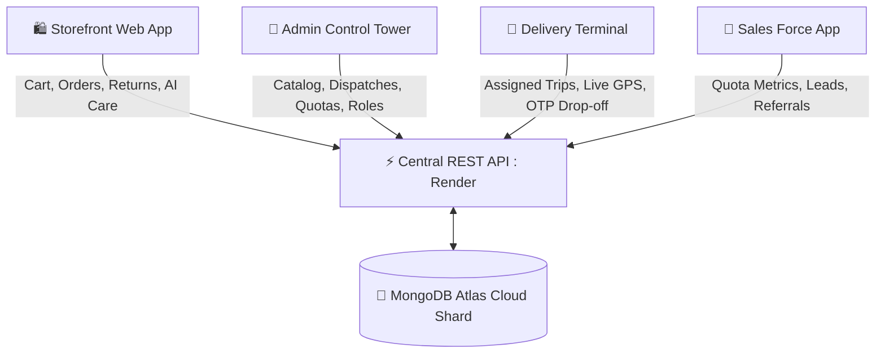

# 🛍️ EasyMart — Enterprise Multi-Channel E-Commerce Ecosystem

An enterprise-grade, fully dynamic, multi-channel commerce platform connecting **Storefront Buyers**, **Administrative Dispatchers**, **Logistics Delivery Couriers**, and **Enterprise Sales Forces** into a unified, real-time MongoDB Atlas ecosystem.

---

## 🌐 Live Production Deployments & Portals

| Application | Live Production URL | Purpose & Capabilities | Fast Access Credentials |
| :--- | :--- | :--- | :--- |
| **🛍️ Consumer Storefront** | [**easy-mart-935dfbax4-mohammedsajadvts-projects.vercel.app**](https://easy-mart-935dfbax4-mohammedsajadvts-projects.vercel.app) | Live product catalog, dynamic festival discounts, AI Customer Support Agent, shopping cart, instant checkout with referral tracking (`?ref=CODE`), and doorstep return requests. | `customer@easymart.com` / `password123` |
| **👑 Admin Control Tower** | [**easy-mart-fjk5-o5oi4qep6-mohammedsajadvts-projects.vercel.app**](https://easy-mart-fjk5-o5oi4qep6-mohammedsajadvts-projects.vercel.app) | Full product CRUD, category management, Amazon/Flipkart courier dispatching, GPS fleet monitoring, sales quota onboardings, and return/refund approvals. | `admin@easymart.com` / `password123` |
| **🚚 Delivery Driver Terminal** | [**easy-mart-vgp7-g5b7po9ng-mohammedsajadvts-projects.vercel.app**](https://easy-mart-vgp7-g5b7po9ng-mohammedsajadvts-projects.vercel.app) | Active trip manifest queue, warehouse pickup verification, real-time GPS telemetry, route navigation, and 4-digit customer handover security OTP verification. | `delivery@easymart.com` / `password123` |
| **💼 Sales Force Web App** | [**easy-mart-lvrc-1zuikgg9v-mohammedsajadvts-projects.vercel.app**](https://easy-mart-lvrc-1zuikgg9v-mohammedsajadvts-projects.vercel.app) | Live revenue performance targets, 5% commission earnings, referral link generator, and direct B2B client lead bookings with celebratory animations. | `sales@easymart.com` / `password123` |
| **⚡ Backend API Cluster** | [**easymart-cew3.onrender.com**](https://easymart-cew3.onrender.com) | Central RESTful API powered by Node.js, Express, Mongoose, JWT, and CORS connected to MongoDB Atlas. | `/api/health` |

---

## 🏛️ Platform Architecture

---

## ✨ Key System Capabilities

### 1. 🛍️ Dynamic Storefront & AI Customer Care
- **Dynamic Festival Engine**: Automatically highlights active festival campaigns (Diwali, Holi, Cyber Monday, Flash Sales) with customizable coupon codes and discount banners.
- **AI Support Agent**: Instant in-app assistant that looks up customer order histories, checks tracking codes, explains return policies, and suggests top catalog products.
- **Connected Referral Flow**: Listens for URL parameters (`?ref=SALES-CODE`) to automatically attribute customer checkouts to sales representatives.

### 2. 👑 Admin Control Tower & Amazon Logistics Model
- **Courier Assignment**: Assign any pending order to verified delivery couriers with pickup warehouse hub routing.
- **Dynamic Role Management**: Promotes accounts instantly across `Customer`, `Delivery Courier`, `Sales Executive`, and `Administrator` with automatic attribute bootstrapping.
- **Doorstep Returns & Refunds**: Handles customer return workflows from initial reverse pickup to final refund crediting.

### 3. 🚚 Delivery Driver Operations
- **Live Trip Queue**: Real-time dispatch manifests queried directly from MongoDB Atlas.
- **Security OTP Verification**: Requires the customer's dynamic 4-digit code before handing over packages, triggering celebratory feedback upon completion.
- **Duty Toggle & Telemetry**: Driver can switch between `Online` / `Offline` status with simulated GPS updates.

### 4. 💼 Sales Force Web App
- **Quota & Commission Tracking**: Live visual progress bars measuring revenue against monthly targets with real-time 5% commission calculation.
- **Direct Lead Booking**: Allows sales reps to enter direct client orders with instant quota attribution.

---

## 🛠️ Technology Stack

- **Frontend & Admin Apps**: React 19, Vite, Redux Toolkit, TailwindCSS, Lucide Icons, Canvas Confetti.
- **Backend**: Node.js, Express, Mongoose, JSON Web Tokens (JWT), Bcrypt.js, Morgan.
- **Database**: MongoDB Atlas Cloud Cluster.
- **Hosting & CI/CD**: Vercel (Frontends with `vercel.json` SPA rewrites) & Render (Node.js API).

---

## 📄 License
MIT License © 2026 Mohammed Sajad VT. All rights reserved.
